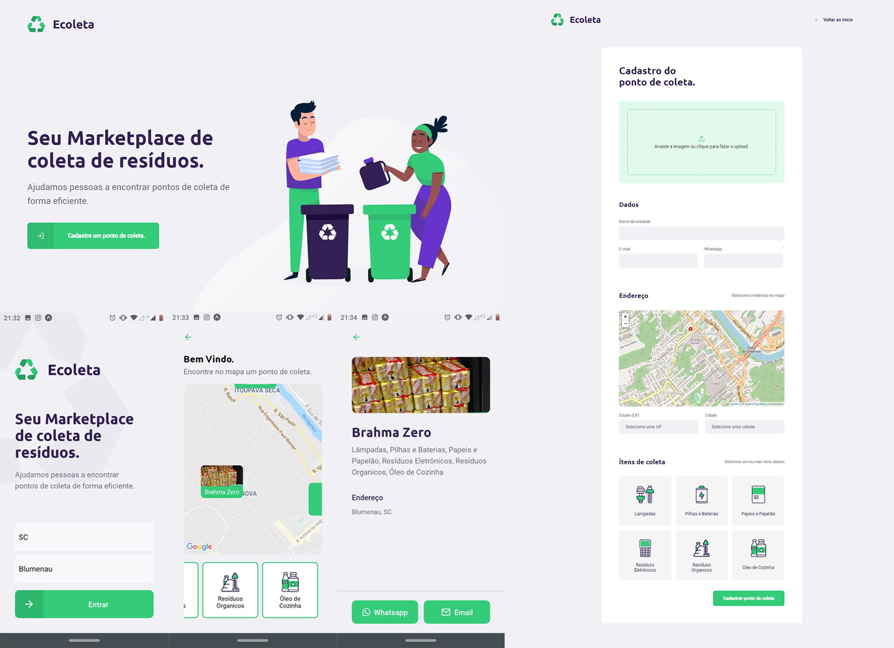

<h3 align="center">
    
    <br><br>
    <b>Your marketplace for waste collection.</b>  
    <br>
</h3>

# About

Ecoleta is a system for locating waste collection points around you. Built for Rocketseat's Next Level Week, with the goal being to improve my knowledge of React and Node.js, all using TypeScript.

It is based in Brazil, thus meaning you can only register places in Brazil (as it uses a third-party API to get the places).


## :computer: Tech

The system is built of three main parts:

<details>
  <summary>Node.js server with SQLite database</summary>
  
-   [Node.js](https://nodejs.org/)
-   [Express](https://expressjs.com/)
-   [Typescript](https://www.typescriptlang.org/)
-   [TS-Node-Dev](https://www.npmjs.com/package/ts-node-dev)
-   [Celebrate](https://github.com/arb/celebrate)
-   [Cors](https://www.npmjs.com/package/cors)
-   [VS Code](https://code.visualstudio.com/)
-   [SQLite](https://www.sqlite.org/)

</details>

<details>
  <summary>React.js webpage</summary>

-   [React](https://pt-br.reactjs.org/)
-   [Typescript](https://www.typescriptlang.org/)
-   [Axios](https://www.npmjs.com/package/axios)
-   [React Dropzone](https://github.com/react-dropzone/react-dropzone)
-   [React Icons](https://react-icons.netlify.com/#/)
-   [Leaflet](https://leafletjs.com/)
-   [React Leaflet](https://react-leaflet.js.org/)
-   [VS Code](https://code.visualstudio.com/)

</details>

<details>
  <summary>React Native Mobile App</summary>

-   [React](https://pt-br.reactjs.org/)
-   [React Native](https://reactnative.dev/)
-   [Expo](https://expo.io/learn)
-   [Typescript](https://www.typescriptlang.org/)
-   [React Navigation](https://reactnavigation.org/)
-   [Axios](https://www.npmjs.com/package/axios)
-   [Expo Google Fonts](https://github.com/expo/google-fonts)
-   [Expo Location](https://docs.expo.io/versions/latest/sdk/location/)
-   [Expo Mail Composer](https://docs.expo.io/versions/latest/sdk/mail-composer/)
-   [React Native Picker](https://reactnative.dev/docs/picker)
-   [VS Code](https://code.visualstudio.com/)

</details>

## :fire: Result!

Here you can see the outcome of the project.



## :rocket: How to run it

### **First of all**

  - You **need** to have **[Node.js](https://nodejs.org/en/)** intalled. If you dont, go get it!
  - Also, a **package manager**, whether it is **[NPM](https://www.npmjs.com/)** or **[Yarn](https://yarnpkg.com/)**.
  - To run the mobile app, **[Expo](https://expo.io/)** is the tool you need.

1. Clone me!! :

```sh
  $ git clone https://github.com/ge5ke/ecoleta.git
```

2. Running it:

```sh
  # Install the dependencies
  $ npm install

  ## To create the database, run these commands
  $ cd server # --> to navigate to the server folder
  $ npm run knex:migrate
  $ npm run knex:seed

  # Start the API
  $ npm run dev

  # Run the web app
  $ cd web # --> to navigate to the web folder
  $ npm start
 ```


In order to run the application on your mobile device, you need to change the ip config, as it cannot work with localhost.

[api.ts](https://github.com/StefanoSaffran/ecoleta/blob/master/mobile/src/services/api.ts)
```javascript
  baseURL: 'http://192.168.0.3:3333',
```
replace 192.168.0.3 with your machine's ip.

Now with everything on place, run the application.

``` 
  # Run the mobile app
  $ cd mobile # --> to navigate to the mobile folder
  $ npm start # or expo start
```

## Next Steps:

- [ ] Comment the code
- [ ] Add a point list to the web app
- [ ] Make it Global

